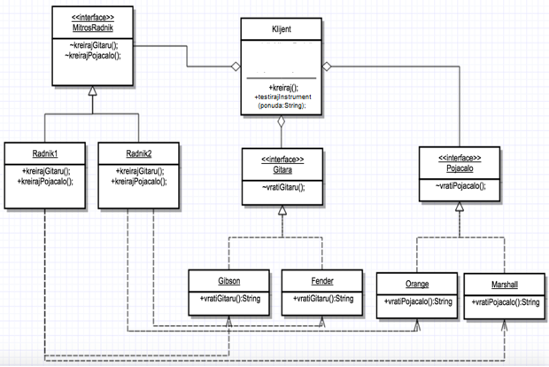
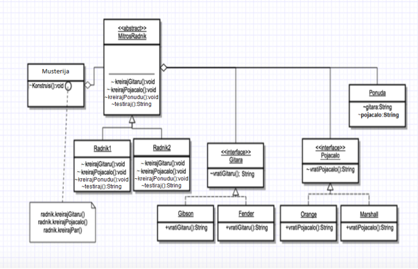
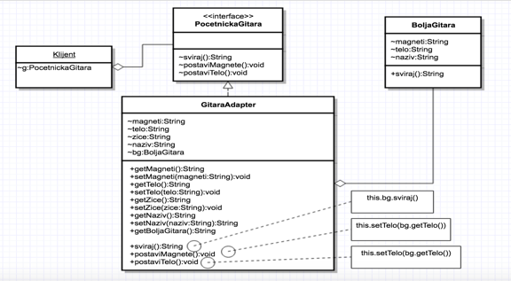
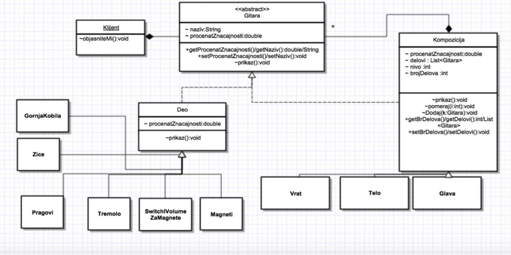
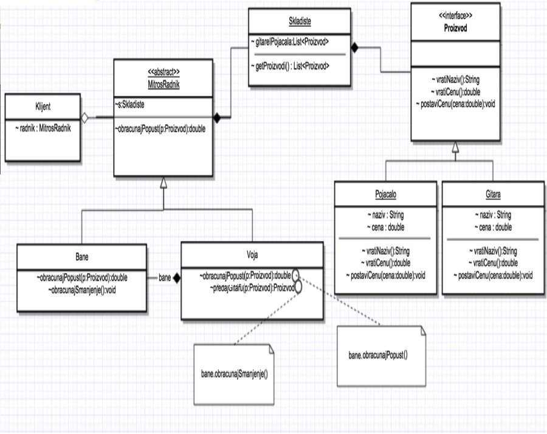
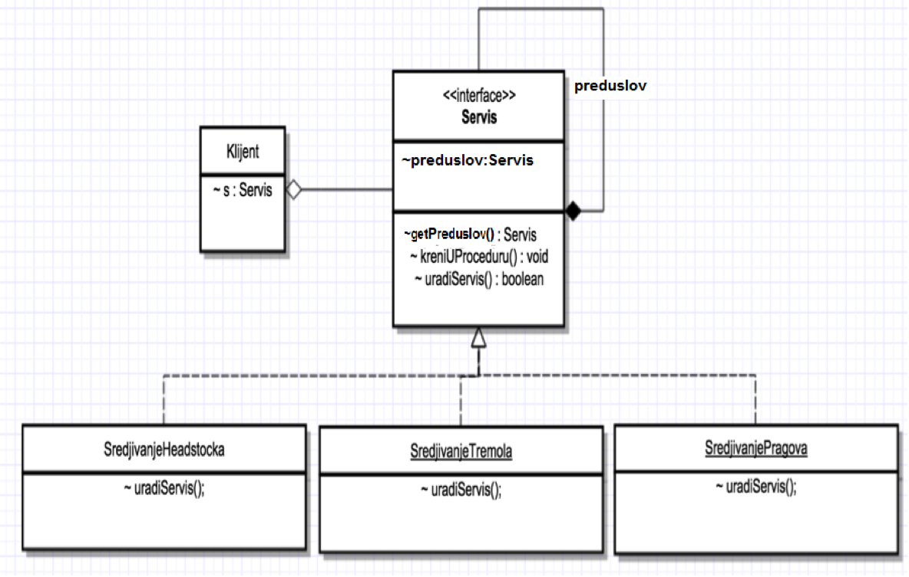
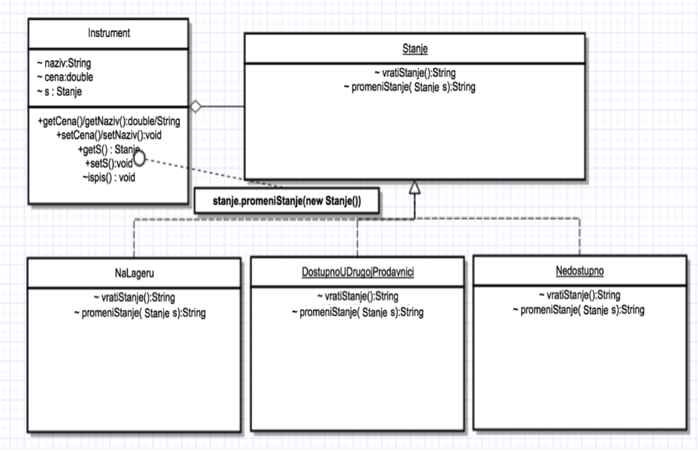
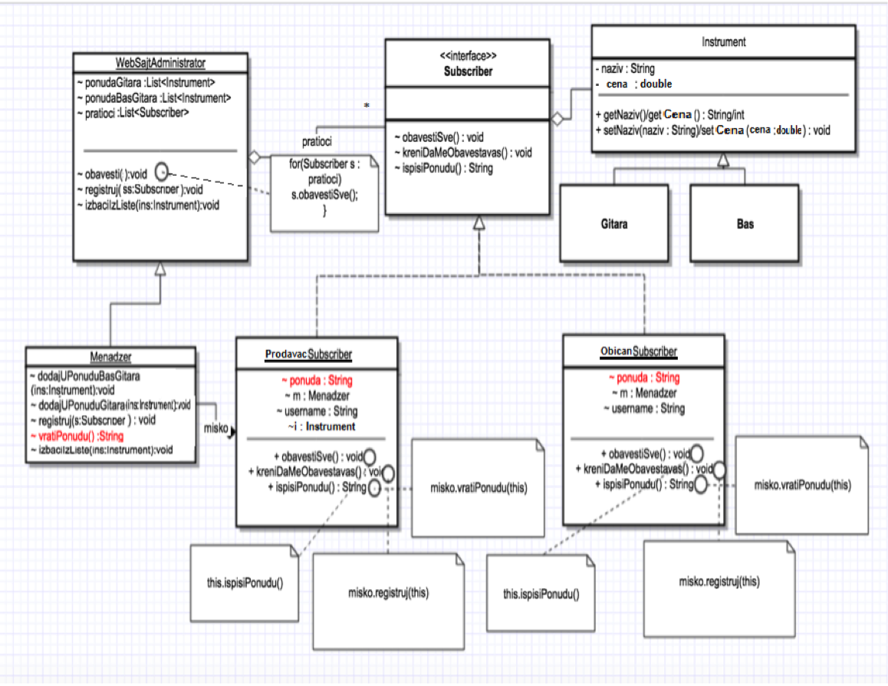

# Design patterns
Implementation of 8 design patterns on illustrative examples in Java programming language. Created to be simple to be understood.

All examples will be continually exampled using story examples. Center of events is music shop. Our classes are being named by employees or music gear. 

Employees in store are choosing for young kid named Pavle a guitar and an amp. After choosing, Pavle tests guitar and amp. Example described Abstract Factory pattern. In case that guitar and amp are being tested by employees, for Pavle, Builder pattern will be used.

<h2>Abstract Factory</h2>

<h2>Builder</h2>

Employees concluded that Pavle doesn't have enough experience in playing guitar, so therefore better option would to be to check out a particular beginners guitar. That was a final decision, with small changes, or adaptation. Parts of guitar will be changed and different in comparing to original. Pattern which will solve this issue is called Adapter pattern.

<h2>Adapter</h2>

Electrical guitar is being composed by several components. Each of these components has their own parts. To be more precise, guitar has body, neck and head. Body contains magnets, tremolo, string, frets etc. Using Composite patterns each of these parts will be described. 

<h2>Composite</h2>

One of the employees got a task to calculate a discount for guitar. Instead of him, delegated employee, that operation will be done by the other employee. Delegated employee will receive result, discount, which will announce to the buyer, Pavle. In this case we will use Proxy pattern. Point of using this pattern is having proxy for realization of some operation.

<h2>Proxy</h2>

Guitar will be bought, but before that, it needs to go through 3 types of service. After that chain of operations, it will be ready for playing. Example of chain of responsability pattern. 

<h2>Chain of responsability</h2>

Pavle decided to check out other guitar, which is currently not in the shop. To buy that guitar, guitar needs to be available in his shop. Luckily that condition, or state, can be changed, since the guitar is at that moment in other shop in other city. With that two states, there was a posibility for that guitar not to be available at all. All these states are being described using State pattern. In conclusion, guitar has been bought. 

<h2>State</h2>

And lastly, shop has part for selling used instruments. That sector functionates like this: Everyone who wants, can be registered as subscriber, and can look up to all available used instruments. Everyone who intends to sell their instruments, register themselves as subscribers, through store manager. After that their instrument is being added as available for buying. After succesful registration, new notification is being generated as well as complete and precise offer, which arrives through email to all subscribers. This is an implementation of an Observer pattern.

<h2>Observer</h2>

