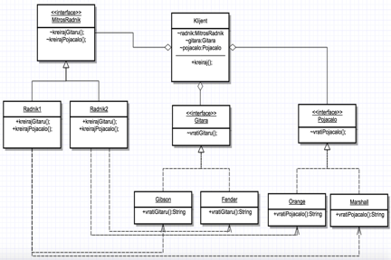
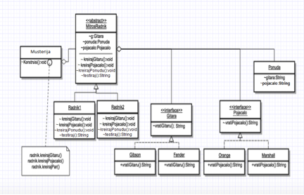
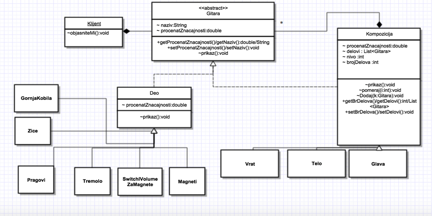
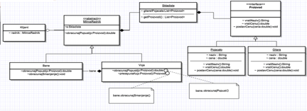
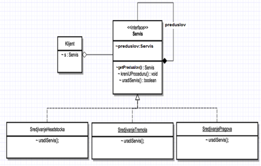
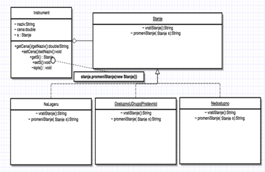
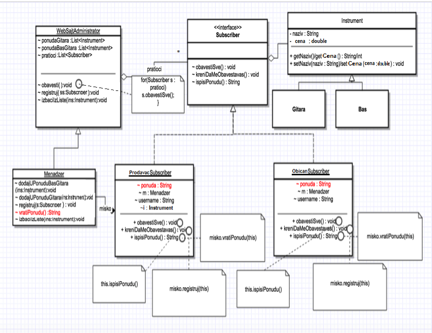

# SoftverskiPaterni
Primena 8 paterna (design patterns) na ilustrativnim primerima u programskom jeziku Java

Svi paterni biće objašnjeni kontinualno kroz primere koji će se nadovezivati. Centar događanja jeste prodavnica muzičke opreme. Naše klase će se zvati najčešće po zaposlenima ili po muzičkoj opremi. Sami primeri neće biti previše kompleksni kako bi mogao da se shvati način funkcionisanja paterna.
 
Zaposleni u radnji biraju za Pavla gitaru i pojačalo. Nakon biranja Pavle testira gitaru i pojačalo. Navedena situacija je predstavljena preko Abstract Factory paterna. U slučaju da gitaru i pojačalo testiraju zaposleni, za Pavla, biće korišćen Builder patern. 

Zaposleni su ipak uvideli da Pavle nema iskustva u sviranju i da bi bolja varijanta bila da proba početničku gitaru. To je bila i konačna odluka, ali ipak sa malim izmenama, odnosno adaptacijom. Delovi gitare biće zamenjeni u odnosu na original. Patern koji će rešiti ovaj problem zove se Adapter patern. 

Električna gitara je sastavljena od više komponenti. Svaka od tih komponenti ima svoje delove. Konkretno, gitara se sastoji iz tela, vrata i glave. Telo sadrži magnete, tremolo, vrat žice i pragove itd. Preko Composite paterna, opisaćemo sve te komponente. 

Jedan od radnika je dobio zadatak da izračuna popust za gitaru. Umesto njega, kao delegiranog zaposlenog, tu operaciju će izvršiti drugi zaposleni. Delegirani će dobiti rezultat, odnosno popust i taj isti popust saopštiti kupcu, tj. Pavlu. U navedenom slučaju koristićemo Proxy patern. Poenta ovog paterna jeste korišćenje posrednika za realizaciju neke operacije. 

Gitara koja će biti kupljena, prethodno mora da prođe kroz 3 vrste servisa. Tek nakon što prođe kroz taj ”lanac” povezanih operacija biće spremna za upotrebu. Radi se o Chain of responsability paternu.
	

U nekom trenutku, Pavle se ipak zainteresovao za drugu gitaru. Ta gitara ne postoji u radnji. Kako bi mogao da kupi datu gitaru, ona bi trebalo da bude dostupna u njegovoj radnji. Srećom, to stanje može biti promenjeno, s obzirom da se gitara nalazi u radnji u drugom gradu. Pored ta dva stanja, postojala je još mogućnost da te gitare uopšte ne bude na lageru. Sva ta stanja koja se menjaju su elementi State paterna. Što se našeg samog problema tiče, gitara je na kraju kupljena.

Prodavnica muzičke opreme ima deo za prodaju polovnih instrumenata. Taj sektor funkcioniše na sledeći način : Svi koji žele, mogu da se registruju kao pratioci, odnosno subscriber-i, tj. mogu da imaju uvid u sve trenutno raspoložive polovne instrumente. Svi koji nameravaju da prodaju svoj instrument, registruju se isto kao subscriberi, preko menadžera radnje, nakon čega se dodaje njihov  instrument u ponudu. Posle uspešne registracije, generiše se novo obaveštenje i novi presek stanja, koji stiže na mejl svim pratiocima. U pitanju je dakle observer patern.

